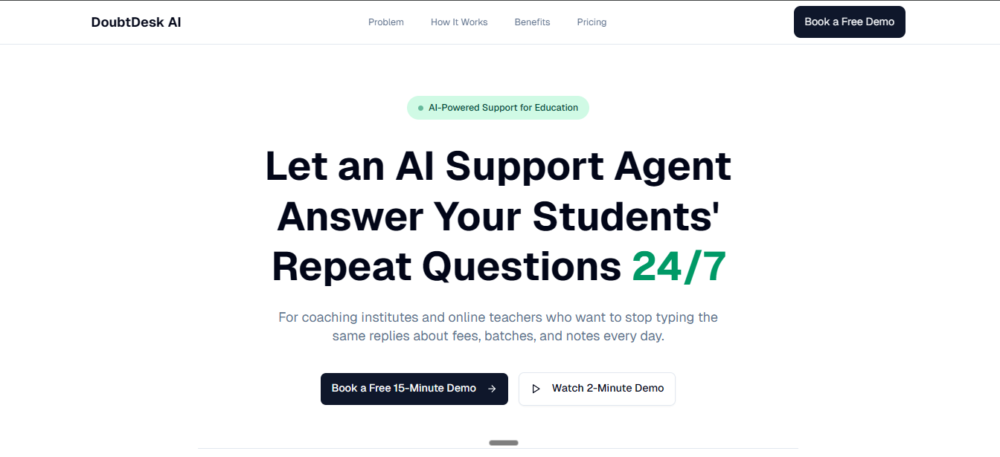
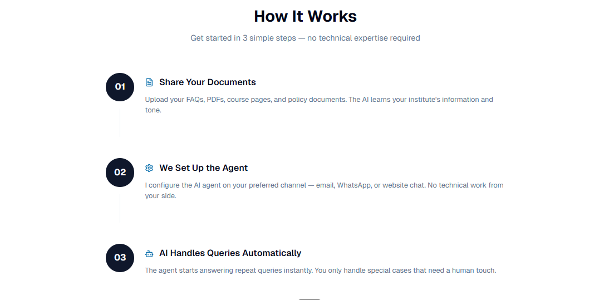
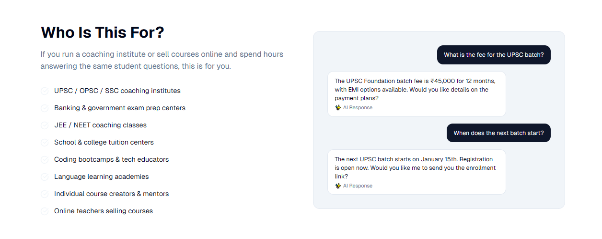

# 🚀 **DoubtDesk — AI-Powered Customer Support Agent for Coaching Institutes & Online Teachers**

DoubtDesk is an AI support agent that helps coaching institutes and online educators **automatically answer repeated student queries** — saving time, improving student satisfaction, and reducing operational load.

If you run a coaching business (UPSC, JEE/NEET, OPSC, SSC, banking, coding, language, etc.) or sell courses online, DoubtDesk ensures your students get **instant, accurate replies 24/7** without you or your team typing the same messages again and again.

---

## 🌟 **Preview of DoubtDesk**

> *Upload your landing page screenshot here*

📸 **DoubtDesk AI**: 
📸  **How It Works**

📸 **AI Chat Flow or Dashboard**

---

## 🧠 **Why DoubtDesk Exists**

Coaching institutes and online teachers receive **hundreds of repetitive questions** daily:

* “What are the fees?”
* “Is EMI available?”
* “What’s the batch timing?”
* “Where are the notes?”
* “How do I log in?”
* “What is the refund policy?”

Answering these manually steals **1–2 hours every day** from founders, teachers, and support teams — while students wait for replies.

**DoubtDesk solves this.**

---

## 🤖 **What DoubtDesk Does**

DoubtDesk automatically:

* Reads student queries from **WhatsApp, email, website chat, Telegram**
* Understands intent behind the message
* Searches your **PDFs, Docs, Notion pages, FAQs, policies**
* Replies instantly in **your institute’s tone**
* Handles repeated questions 24/7
* Escalates complex or sensitive issues to a human

This means:
**Less typing. Faster replies. Happier students. More time for teaching.**

---

## 🎯 **Who Can Use This**

DoubtDesk is built for:

* Coaching institutes (UPSC, OPSC, JEE/NEET, SSC, banking, CAT)
* Mentorship programs
* Individual course creators selling courses or notes
* Teachers who manage daily student queries
* Academies running online or offline batches

If you have **students**, you have **support queries** — and DoubtDesk handles them for you.

---

## ⚡ **Key Features**

### 🟦 **1. AI Answers Repeated Questions Automatically**

Students get instant replies for common queries:
Fees • EMI • Batches • Notes • Login issues • Refunds • Course details

### 🟦 **2. Uses Your Own Documents**

Upload your policies, fee structures, FAQs, PDF notes —
DoubtDesk learns from **your actual content**, not generic AI knowledge.

### 🟦 **3. Integrates with Your Existing Channels**

* WhatsApp Business
* Email
* Website Chat Widget
* Telegram

No migration needed.

### 🟦 **4. Human Escalation When Needed**

If a case is complex, the AI hands it off to you or your team.

### 🟦 **5. 24/7 Support Without Hiring**

Your institute stays responsive — even at midnight.

---

## 🌈 **Benefits**

### ✔ **Save 1–2 hours every day**

Stop typing the same replies repeatedly.

### ✔ **Improve student satisfaction**

Instant, accurate information builds trust.

### ✔ **Reduce support workload by 50%+**

Teams focus on meaningful work, not copy-pasting.

### ✔ **Scale your institute**

More students → no increase in manual support.

---

## 🛠️ **Tech Stack**

(Modify as needed based on your real stack)

* **Frontend:** Next.Js, Tailwind, Framer Motion
* **Automation:** n8n workflows
* **AI Model:** Hugging Face / Gemini / Llama / Groq
* **Retrieval:** Pinecone Vector Database 

* **Integrations:** WhatsApp Business API, Email (SMTP/IMAP), Website Chat Widget

## 🧪 **Free 7-Day Trial for Institutes**

DoubtDesk includes a **free 7-day trial** on one support channel
(WhatsApp, email, or website chat).

No risk. No credit card.
If it doesn’t save your time → you simply don’t continue.

---

## 📞 **Book a Demo**

➡️ **Book a Free 15-Minute Demo**
(Your link goes here)

➡️ **Watch 2-Minute Product Demo**
(Your link goes here)

---

## 💡 **Why This Project Matters**

Education businesses grow when teachers focus on **teaching**, not **replying**.

DoubtDesk gives institutes:

* More time
* Better student experience
* Professional communication
* A scalable support system

This is **the future of student support** for coaching institutes.

---

---

## 📜 License

MIT License.

